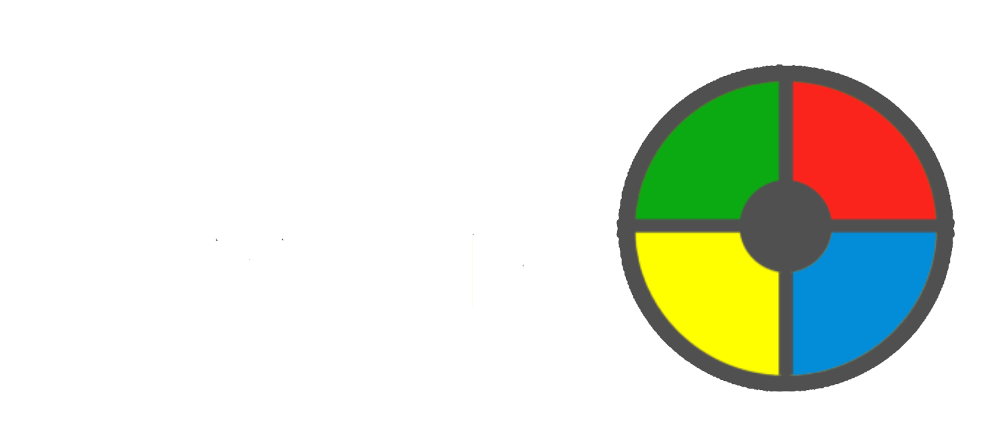
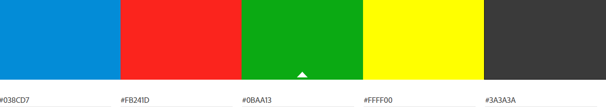

<h1 align="center">2P Juan Jose Ruiz Ruiz - Simon Game</h1>

[View the live project here.](https://deneb331.github.io/2P-JuanJoseRuizRuiz-SimonSays/)

This site is a recreation of the classic game Simon, in which the user has to remember a sequence of colors and introduce it in the right order.

<h2 align="center"></h2>

<h2 align="center"></h2>

## User Experience (UX)

-   ### User stories

    -   #### First Time Visitor Goals
        1. As a First Time Visitor, I want the user to be able to understand the game and play as fast as possible.

    -   #### Returning Visitor Goals
        1. As a Returning Visitor, I want to be able to restart the game quickly enough to not lose interest.

    -   #### Frequent User Goals
        1. As a Frequent User, I want to be able to have some way of saving history of my score.

-   ### Design
    -   #### Colour Scheme
        -   The main colours used in this website are the ones used in the original Simon Game.
        <h2 align="center"></h2>

    -   #### Typography
        -   The Kanit font is the only one used in this project, as it gives a similar feeling as the original Simon game font, but feels more modern and fresh.

    -   #### Imagery
        -   The logo image has been created as a simplified version of the table game, using plain colours contained in a grey circle. The game buttons simulate that they are iluminated when pressed or when the game starts, trying to keep the essence of the original game.

## Features

-   Responsive on all device sizes

-   Interactive elements

-   Email the score to the user

-   Input validation (blank fields only)

## Technologies Used

### Languages Used

-   [HTML5](https://en.wikipedia.org/wiki/HTML5)
-   [CSS3](https://en.wikipedia.org/wiki/Cascading_Style_Sheets)
-   [JS](https://en.wikipedia.org/wiki/JavaScript)

### Frameworks, Libraries & Programs Used

1. [Hover.css:](https://ianlunn.github.io/Hover/)
    - Hover.css was used on the the start and send email buttons to show the user easily where he/she can interact.
1. [Google Fonts:](https://fonts.google.com/)
    - Google fonts were used to import the 'Kanit' font into the style.css file which is used on the whole project.
1. [EmailJS:](https://www.emailjs.com/)
    - EmailJS was used to send a mail to the user with his/her score.
1. [Git](https://git-scm.com/)
    - Git was used for version control by utilizing the Gitpod terminal to commit to Git and Push to GitHub.
1. [GitHub:](https://github.com/)
    - GitHub is used to store the projects code after being pushed from Git.
1. [Photopea:](https://www.photopea.com/)
    - Photopea was used to remove the background to the logo, so it can be used in this document, and to create the logo and all the images used in the project.
1. [Adobe Color Wheel:](https://color.adobe.com/es/create/color-wheel)
    - Adobe Color Wheel was used to create the color palette for the website.
1. [TinyPNG:](https://tinypng.com/)
    - TinyPNG was used to optimize the images used in the website.

## Testing

The W3C Markup Validator and W3C CSS Validator Services were used to validate every page of the project to ensure there were no syntax errors in the project.

-   [W3C Markup Validator](https://jigsaw.w3.org/css-validator/#validate_by_input)
        <h2 align="center"></h2>
-   [W3C CSS Validator](https://jigsaw.w3.org/css-validator/#validate_by_input)
        <h2 align="center"></h2>
-   [JSHint](https://jshint.com/)
        <h2 align="center"></h2>

### Testing User Stories from User Experience (UX) Section

-   #### First Time Visitor Goals

    1. As a First Time Visitor, I want the user to be able to understand the game and play as fast as possible.

        1. Upon entering the site, users find the name of the game, with a short description of how to play, a visible start button, and 
        2. The game takes most of the website space, so the user will not lose it.

-   #### Returning Visitor Goals

    1. As a Returning Visitor, I want to be able to restart the game quickly enough to not lose interest.

        1. The website checks automatically if the user chose the correct sequence or not.
        2. When the game finishes, the users just have to press the start button to try again.

-   #### Frequent User Goals

    1. As a Frequent User, I want to be able to have some way of saving history of my score.

        1. At the end of the website, the user can find a small form he can complete to get the score in his/her email.

### Further Testing

-   The Website was tested on Google Chrome, Microsoft Edge and Opera browsers.
-   The website was viewed on a variety of devices such as Desktop, Laptop and Xiaomi Redmi Note 10.
-   A large amount of testing was done to ensure that all pages were linking correctly.
-   Friends were asked to review the site and documentation to point out any bugs and/or user experience issues.

### Bug Log

- Game buttons don't align correctly - fixed using grid display instead of flex display.
- Game buttons don't change image correctly - fixed making the button change their images adding and removing a temporal class.
- Email button seems to not be working correctly - fixed after changing some errors in emailjs.send function and the params dictionary.
- The functions executed with setTimeout() don't take the time expected to execute - The syntax of the setTimeout tool was wrong.

## Deployment

### GitHub Pages

The project was deployed to GitHub Pages using the following steps...

1. Log in to GitHub and locate the [GitHub Repository](https://github.com/)
2. At the top of the Repository (not top of page), locate the "Settings" Button on the menu.
3. Locate the "Pages" Section in the lateral menu.
4. Under "Source", click the dropdown called "None" and select "Main Branch".
5. The page will automatically refresh.
6. Scroll back down through the page to locate the now published site [link](https://deneb331.github.io/2P-JuanJoseRuizRuiz-SimonSays/) in the "GitHub Pages" section.

## Credits

### Code

-   The main references used to build this website are the Love Maths CI project for JS reference, and my first project, [Holy Games](https://deneb331.github.io/1P-JuanJoseRuiz-HolyGames/), for HTML and CSS references and refreshing.

-   [W3Schools](https://www.w3schools.com/) : For research about CSS features.

-   [MDNWebDocs](https://developer.mozilla.org/en-US/docs/Web) : For research about JS features.

-   [30SecondsOfCode](https://www.30secondsofcode.org/) : For research about array comparison

### Content

-   All content was written by the developer, based in the projects and templates given by Code Institute, my first project and my mentor help.

### Media

-   All images were created by the developer using [Photopea](https://www.photopea.com/).

### Acknowledgements

-   My Mentor for continuous helpful feedback and resources.
-   The Slack community for the instant help whenever I needed it.
